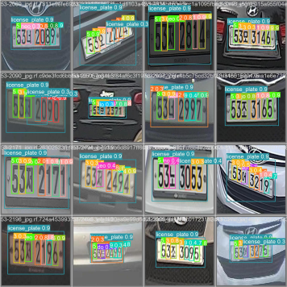
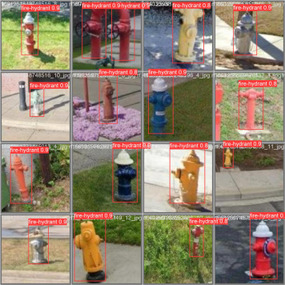
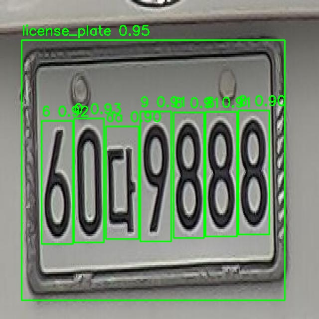
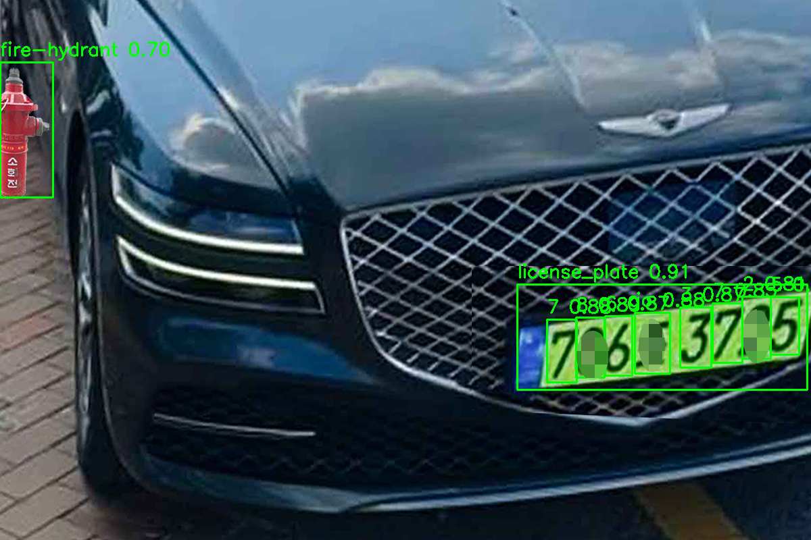

# YOLOv5 Parking Violation Detection with TTS Alerts

This project uses YOLOv5 to detect license plates, license plate characters, and fire hydrants. It also classifies vehicle types (e.g., large, small, emergency). The system then uses a VITS TTS model to generate audio alerts based on the detected information.

The text recognition is done solely with YOLOv5, eliminating the need for additional training. The TTS model was trained using the VITS model from Kakao.

- [YOLOv5](https://github.com/ultralytics/yolov5)
- [VITS Reference 1](https://github.com/jaywalnut310/vits)
- [VITS Reference 2](https://github.com/ouor/vits?tab=readme-ov-file)

## Installation

1.  Create and activate a new conda environment:
    ```sh
    conda create -n detect_car python==3.9
    conda activate detect_car
    ```

2.  Install the required PyTorch version:
    ```sh
    pip3 install torch==1.13.1 torchvision==0.14.1 torchaudio==0.13.1 --index-url https://download.pytorch.org/whl/cu117
    ```

3.  Install the remaining dependencies:
    ```sh
    pip install -r requirements.txt
    ```
    
4. Navigate to the vits directory and install its requirements:
    ```sh
    cd vits
    pip install -r requirements.txt
    ```

## Model Weights

The YOLOv5 models were trained on a custom dataset of 4500 license plates and 1500 fire hydrants for 100 and 200 epochs, respectively. The VITS TTS model was trained on the Korean Single Speaker Speech Dataset (KSS), which can be downloaded from [here](https://www.kaggle.com/datasets/bryanpark/korean-single-speaker-speech-dataset).

Download the pre-trained model weights from this [Google Drive link](https://drive.google.com/drive/folders/1or_V69FZXuKrP0Shms51-A8xhTkm7ppT?usp=drive_link) and place them in the correct directories as shown below:

```
./
├── vits/
│   └── checkpoints/
│       └── lasttry/
│           ├── G_51000.pt
│           └── D_51000.pt
├── fire_epoch200.pt
└── car_epoch100.pt
```

## Usage

1.  Open the `main.py` file and specify the path to the image you want to process.

2.  Run the main script:
    ```sh
    python main.py
    ```

The output will include the detected license plate text and an audio file with the TTS alert. These can be found in the `others_result` folder.

## Results

<table>
  <tr>
    <td align="center"><b>System Flowchart</b></td>
    <td align="center"><b>Project Overview</b></td>
  </tr>
  <tr>
    <td></td>
    <td></td>
  </tr>
  <tr>
    <td align="center"><b>License Plate Detection</b></td>
    <td align="center"><b>Full Detection Result</b></td>
  </tr>
  <tr>
    <td></td>
    <td></td>
  </tr>
</table>
